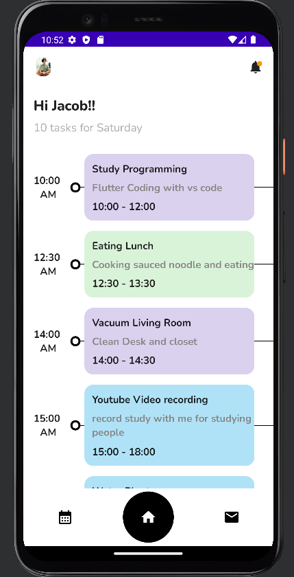

# TaskManagerUI
### Jetpack compose에 대하여 좀 더 알아보기

## 내용 요약
 
> 2023.08.14 - 2023.08.14   
 
> **Android에서 현재 밀고 있는 Jetpack compose UI 화면 구성**
* Row, Column, Box, Text 등 Flutter에서 사용하고 있는 위젯 배치 구성과 위젯들의 종류에 대해서 살펴보기
* Jetpack compose를 통해 기존의 Android 화면에서 구성하기 힘들었던 화면도 쉽게 만들 수 있다는 것을 알 수 있는 시간이였습니다.
* Flutter를 학습하면서 Native 학습이 필요하다고 느껴 코틀린을 배우고 있는데 이 예제를 통해서 Flutter와 비슷하게 위젯을 구성하고 배치할 수 있다는 것을 알 수 있었습니다.
 

## 참고 영상(Breens Robert)
https://www.youtube.com/watch?v=0CdKHsayi8s&t=233s
